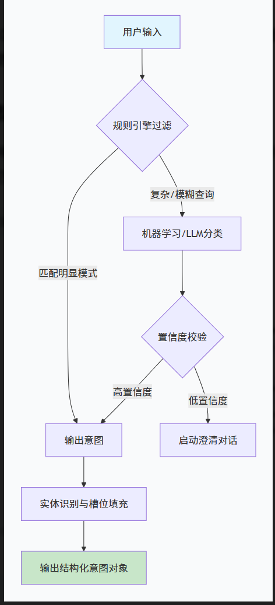

根据以上流程图和以下要求实现意图识别功能：
1.规则引擎过滤 (第一道防线)：对于常见、模式固定的查询（如“今天的销量是多少？”），通过关键词匹配和正则表达式快速判断意图
2.意图类别设计：通过deepseek将意图进行分类，包括查询、计数、过滤、排序、信息不完整、
3.实体识别与槽位填充：出用户想“做什么”后，下一步就是找出“对谁做”和“怎么做”，即提取关键信息（实体）并填入预定义的“槽位”中。

-实体类别：主要包括时间、地域、指标、维度、值、操作

-实现技术：利用大模型的语义理解能力，直接将问题中的实体“抽取”出来
-槽位结构设计：为了高效地存储和传递信息，我们可以为每个意图设计一个结构化的JSON。例如，对于“查询类”意图，可以定义如下JSON结构：
{
  "intent_type": "QUERY",
  "select_columns": ["销售额"],
  "aggregation": "SUM",
  "table_name": "sales_fact",
  "conditions": [
    {"column": "区域", "operator": "=", "value": "华东区"},
    {"column": "日期", "operator": "BETWEEN", "value": ["2024-01-01", "2024-12-31"]}
  ],
  "group_by": ["区域"],
  "order_by": {"column": "销售额", "direction": "DESC"},
  "limit": 5
}

